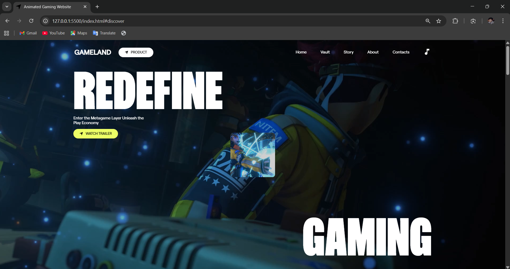

# Animated Gaming Landing

A static, animated gaming landing page built with HTML, CSS, JS, and GSAP/ScrollTrigger.

## 🚀 Live Demo

**[View Live Demo](https://animated-gaming-website-rho.vercel.app/)**

## Features
- Smooth scrolling between hero, discover, story, and contact sections
- GSAP-driven animations and scroll effects
- Responsive layout with minified production assets

## Structure
- `index.html`
- `css/` (minified and dev styles)
- `js/` (minified and dev scripts)
- `assets/` (fonts, images)
- `files/` (media clips)

## Screenshots

### Demo Video

https://github.com/user-attachments/assets/0c66dbf3-6a44-447b-97cc-327381e2e131

## Notes
- Main stylesheet: `css/index.min.css`
- Main script bundle: `js/index.min.js`
